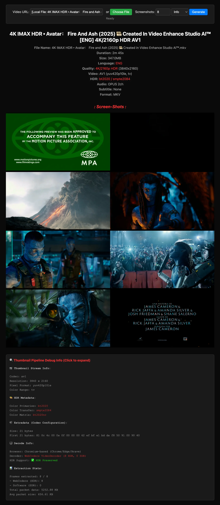

<div align="center">


### Play any video format directly in the browser.
##### No transcoding. No server processing. <br /> Just `<movi-player src="video.mkv" controls>`.

[](https://www.npmjs.com/package/movi-player)
[](https://www.npmjs.com/package/movi-player)
[](https://www.npmjs.com/package/movi-player)
[](LICENSE)
[](https://github.com/MrUjjwalG/movi-player/stargazers)

**[Web App](https://moviplayer.com)** &nbsp;·&nbsp; **[Documentation](https://mrujjwalg.github.io/movi-player/)** &nbsp;·&nbsp; **[Live Demo](https://movi-player-examples.vercel.app/element.html)** &nbsp;·&nbsp; **[Examples](https://github.com/MrUjjwalG/movi-player-examples)** &nbsp;·&nbsp; **[Changelog](CHANGELOG.md)**


<sub>Built with care by <a href="https://github.com/mrujjwalg"><b>mrujjwalg</b></a> · MKV · HEVC · AV1 · 4K HDR · DRM · Encrypted Streaming</sub>

</div>

---

## Why Movi Player?

**The browser can't play MKV, HEVC, or HDR videos.** You either transcode everything server-side or tell users "format not supported." Movi Player fixes this.

- **Play anything** -- MKV, HEVC, AV1, 4K HDR, multi-audio, subtitles. Formats that `<video>` can't touch.
- **Zero server cost** -- No FFmpeg on your server. No transcoding pipeline. Everything runs in the browser via WebAssembly.
- **Drop-in replacement** -- `<movi-player src="video.mp4" controls>` works like `<video>` but plays everything.
- **Content protection** -- Built-in encrypted playback with AES-256-GCM, token auth, HMAC signing. No DRM license server needed.
- **HDR rendering** -- Detects and renders BT.2020/PQ/HLG content on supported displays. Other players can't.
- **Canvas-based** -- No `<video>` element exposed. Right-click save disabled.
- **Picture-in-Picture** -- Document PiP with controls (play/pause, seek, mute, progress). Chromium 116+.
- **Ambient mode** -- Dynamic letterbox glow that samples video colors in real-time. Press `G` or use context menu.
- **Split sources** -- Separate video, audio, and subtitle file URLs via `videosrc`, `audiosrc`, `subtitlesrc` attributes.
- **Adaptive streaming** -- HLS (`.m3u8`), MPEG-DASH (`.mpd`), and Smooth Streaming (`.ism`) unified through Shaka Player, with a live-edge UI and DVR seeking.
- **Custom request headers** -- Send auth tokens / signed headers across manifests, segments, progressive HTTP, and the encrypted source via the `headers` attribute.
- **DRM ready** -- Optional Widevine/PlayReady/FairPlay support via `drm` + `licenseurl` attributes for adaptive streams.

### vs. Other Players

| | Movi Player | video.js | hls.js | Plyr |
|---|---|---|---|---|
| MKV / HEVC / AV1 | Yes | No | No | No |
| HDR rendering | Yes | No | No | No |
| No server transcoding | Yes | No | No | No |
| Canvas rendering (no `<video>`) | Yes | No | No | No |
| Encrypted playback | Yes | No | No | No |
| Audio-only mode (cover art + strip UI) | Yes | No | No | No |
| Built-in subtitle rendering | Yes | Plugin | No | No |
| Multi-audio track switching | Yes | Plugin | Yes | No |
| Chapters on progress bar | Yes | Plugin | No | No |
| Picture-in-Picture | Document PiP | Basic | No | No |
| DRM (Widevine/FairPlay) | Optional | Plugin | Yes | No |
| Custom SourceAdapter (any protocol) | Yes | No | No | No |
| Bundle size | 50-410KB | 500KB+ | 60KB | 25KB |

## Install

```bash
npm i movi-player
```

Also available as a **desktop app** (Windows / macOS / Linux) for playing local files and URLs with native always-on-top Picture-in-Picture and a playlist — see [`desktop/`](desktop/). Browser and editor integrations live in [`chrome-extension/`](chrome-extension/) and [`vscode-extension/`](vscode-extension/).

## Usage

### HTML Element (simplest)

```html
<script type="module" src="https://cdn.jsdelivr.net/npm/movi-player/dist/element.js"></script>

<movi-player src="video.mp4" controls autoplay muted></movi-player>
```

Or with npm:

```html
<script type="module">
  import "movi-player";
</script>

<movi-player src="video.mp4" controls autoplay muted></movi-player>
```

### Local File

```html
<movi-player id="player" controls></movi-player>
<input type="file" onchange="document.getElementById('player').src = this.files[0]" />
```

### Programmatic

```typescript
import { MoviPlayer } from "movi-player/player";

const player = new MoviPlayer({
  source: { type: "url", url: "video.mp4" },
  canvas: document.getElementById("canvas"),
});

await player.load();
await player.play();
```

### Encrypted Playback

```html
<movi-player
  encrypted
  tokenurl="/api/token"
  videourl="/api/video"
  videoid="movie.mp4"
  controls autoplay muted
></movi-player>
```

AES-256-GCM encrypted, HMAC signed, 2s token expiry, IP + fingerprint binding.
See [encrypted-server/](encrypted-server/) for the server example.

### Adaptive Streaming (HLS / DASH / Smooth)

```html
<!-- HLS -->
<movi-player src="https://example.com/master.m3u8" controls autoplay muted></movi-player>

<!-- MPEG-DASH -->
<movi-player src="https://example.com/manifest.mpd" controls autoplay muted></movi-player>

<!-- Smooth Streaming -->
<movi-player src="https://example.com/manifest.ism/manifest" controls autoplay muted></movi-player>
```

`.m3u8`, `.mpd`, and `.ism` are unified through Shaka Player (with hls.js / dash.js as automatic fallbacks) and drawn to the same canvas pipeline, so the quality menu, stats, and track switching work identically across all three. Live streams get a `LIVE` badge, jump-to-edge, DVR-window seeking, and an Auto-mode quality badge.

### Custom Request Headers

```html
<!-- JSON attribute -->
<movi-player
  src="https://example.com/master.m3u8"
  headers='{"Authorization":"Bearer <token>"}'
  controls autoplay muted
></movi-player>
```

```js
// Or the property (preferred for non-trivial maps)
player.headers = { Authorization: `Bearer ${token}` };
```

Headers ride along on every media request -- manifest + segments, progressive HTTP, thumbnails, and the encrypted source.

### DRM (Widevine / PlayReady / FairPlay)

```html
<movi-player
  src="https://example.com/encrypted.m3u8"
  drm
  licenseurl="https://license.pallycon.com/ri/licenseManager.do"
  controls autoplay
></movi-player>
```

Requires a DRM license server (PallyCon, EZDRM, BuyDRM, etc.). Key systems are tried Widevine → PlayReady → FairPlay. In DRM mode, the native `<video>` element is used (canvas features like rotation are disabled).

### Demuxer Only (50KB)



[Live Demo](https://movi-player-examples.vercel.app/demuxer.html) | [Source](https://github.com/MrUjjwalG/movi-player-examples/blob/main/demuxer.html)

Extract metadata, tracks, HDR info, and thumbnails without playing the video.

```typescript
import { Demuxer, HttpSource } from "movi-player/demuxer";

const demuxer = new Demuxer(new HttpSource("video.mp4"));
const info = await demuxer.open();

console.log(`Duration: ${info.duration}s, Format: ${info.formatName}`);
console.log(`Chapters: ${info.chapters.length}`);

const video = demuxer.getVideoTracks()[0];
console.log(`${video.width}x${video.height} ${video.codec} ${video.frameRate}fps`);
console.log(`HDR: ${video.isHDR}, Color: ${video.colorPrimaries}/${video.colorTransfer}`);

const audio = demuxer.getAudioTracks();
console.log(`Audio: ${audio.map(a => `${a.codec} ${a.language}`).join(", ")}`);

const subs = demuxer.getSubtitleTracks();
console.log(`Subtitles: ${subs.map(s => `${s.codec} ${s.language}`).join(", ")}`);

demuxer.close();
```

Use cases: video validators, asset management, HDR detection pipelines, search indexing, format analysis before transcoding.

## Modules

| Module | Size | Gzip | Brotli | What you get |
|---|---|---|---|---|
| `movi-player` / `movi-player/element` | ~410KB | 2.57 MB | 1.95 MB | Full player with UI, controls, gestures |
| `movi-player/player` | ~180KB | 2.52 MB | 1.91 MB | Programmatic playback, no UI |
| `movi-player/demuxer` | ~50KB | 2.31 MB | 1.74 MB | Metadata extraction, decoding only |

> **Note:** Module sizes (first column) exclude the embedded WASM binary. Gzip/Brotli columns show the total transfer size including WASM. Enable Brotli compression on your server for optimal delivery.

## Features

**Playback** -- MP4, MKV, WebM, MOV, TS, AVI. H.264, HEVC, VP9, AV1. Hardware decode with software fallback. Pitch-preserving time-stretch via Signalsmith Stretch.

**Adaptive Streaming** -- HLS (`.m3u8`), MPEG-DASH (`.mpd`), and Smooth Streaming (`.ism`) unified through Shaka Player (hls.js / dash.js fallbacks). Live-edge badge, DVR-window seeking, Auto-mode quality badge. Optional MPEG-5 LCEVC enhancement-layer decoding via `lcevc` + `lcevcurl`.

**Custom Headers** -- Send auth tokens / signed headers across the whole media flow (manifest, segments, progressive HTTP, thumbnails, encrypted source) via the `headers` attribute (JSON) or property (object).

**Audio** -- AAC, MP3, Opus, FLAC, AC-3, E-AC-3. Multi-track switching. **Output-device routing** (`audiooutput` attribute / `setAudioOutput()` / right-click "Audio Output" menu, via `AudioContext.setSinkId`). Stable volume (loudness normalization). First-class audio-only mode with cover art extraction and a dedicated strip UI. Data-saver `audioonly` mode skips the video decode (and fetches an audio-only stream rendition). Perceptual (log) volume curve. Muted-autoplay fallback with tap-to-unmute.

**Non-Range Servers** -- Servers that ignore `Range` (respond `200`, not `206`) still play via a forward-only sliding-window "linear mode" with in-window seeking; the `linearmode` event lets your UI adapt.

**Subtitles** -- SRT, ASS, WebVTT, PGS (image-based), DVB. Multi-track with on-the-fly switching. Per-source delay/offset (`Z` / `X` to nudge ±100ms), full transcript browser with search + click-to-seek, customizable size/color/background/edge (persisted), karaoke-aligned VTT.

**HDR** -- BT.2020/PQ/HLG detection + Display-P3 rendering on supported browsers.

**Immersive / VR** -- 360° equirectangular, 180° (VR180), fisheye, side-by-side stereo (3D), and stereographic "little planet" video via a WebGL2 raycast with a spring-animated look-around camera. Auto-enters from the source's spherical metadata (no toggle UI) or force a projection with the `vr` attribute (`vr="180 fisheye sbs"`, `vr="littleplanet"`); opt-in on-screen joystick via `vrpad`.

**UI** -- Controls, context menu, keyboard shortcuts (`?` to view all), themes (dark/light), gestures, ambient mode.

**Persistent Preferences** -- Volume, mute, playback rate, stable volume, ambient mode, and HDR toggles persist across reloads via OPFS. User choices override HTML attribute defaults.

**Picture-in-Picture** -- Document PiP with play/pause, seek, mute, progress bar. Press `P`.

**Aspect Ratio** -- Press `A` to cycle contain/cover/fill/zoom. Context menu sub-menu with icons.

**Nerd Stats** -- Press `I` for codec, resolution, FPS, decoder type, buffer health, network graph. HLS-aware stats. 8K/16K resolutions labeled correctly.

**Timeline** -- Press `T` for thumbnail strip. Chapter-aware. Keyboard navigation (arrows + enter).

**Chapters** -- Auto-detected from video metadata. Markers on progress bar, titles in seek tooltip.

**Rotation** -- Press `R` to rotate 90. Metadata rotation auto-applied. Thumbnails sync.

**Resume** -- `<movi-player resume>` saves position to localStorage, shows resume dialog on reload. Keyboard navigable.

**Poster from Timestamp** -- `postertime="10%"` (or `"5"`, `"1:30"`, `"0:01:30"`) generates a native-resolution poster frame from any timestamp. Runs on an isolated thumbnail pipeline, respects rotation metadata, and never paints stale frames after a `src` change.

**Encrypted** -- AES-256-GCM chunked encryption with HMAC-signed token auth. See encrypted-server/.

**Custom SourceAdapter** -- Plug any byte protocol (WebSocket, WebRTC, IndexedDB, custom encryption) directly into the element or player. Same `SourceAdapter` contract works across `<movi-player>`, `MoviPlayer`, and `Demuxer`.

**DRM** -- Optional Widevine/FairPlay for HLS streams via `drm` + `licenseurl` attributes. Uses native `<video>` + EME API.

**Premuxed Quality Menu** -- Multiple `<source data-height="...">` children give you a YouTube-style quality picker for plain MP4/MKV files, no HLS manifest needed.

**File Revoked Recovery** -- Mobile browsers silently revoke `File` handles after long backgrounding; the `filerevoked` event fires so playlist UIs can prompt for re-pick instead of hanging forever.

**Host Fullscreen Handoff** -- Cancelable `movi-fullscreen-request` event + `setHostFullscreen()` so embedders (VS Code webview, custom apps) can take over fullscreen and keep the player's UI in sync.

## Element Attributes

```html
<movi-player
  src="video.mp4"           <!-- Video URL or set via JS: player.src = file -->
  controls                  <!-- Show player controls -->
  autoplay                  <!-- Auto-play on load -->
  muted                     <!-- Start muted -->
  loop                      <!-- Loop playback -->
  volume="0.8"              <!-- Initial volume 0..1 -->
  playbackrate="1.25"       <!-- Initial playback speed -->
  poster="thumb.jpg"        <!-- Poster image -->
  theme="dark"              <!-- dark | light -->
  themecolor="#ff5722"      <!-- Custom primary color (hex/rgb) -->
  objectfit="contain"       <!-- contain | cover | fill | zoom | control -->
  hdr                       <!-- Enable HDR rendering -->
  ambientmode               <!-- Ambient background glow -->
  ambientwrapper="wrapper"  <!-- External element id for ambient glow -->
  thumb                     <!-- Enable seek thumbnails -->
  fastseek                  <!-- Enable skip buttons and gestures -->
  doubletap="true"          <!-- Double-tap to seek ±10s -->
  title="My Video"          <!-- Video title (in-player overlay only) -->
  showtitle                 <!-- Show title overlay at top -->
  startat="30"              <!-- Start at time (seconds) -->
  postertime="10%"          <!-- Generate poster from timestamp ("5", "1:30", "10%") -->
  subtitledelay="0.2"       <!-- Subtitle offset in seconds (positive = later, mpv/VLC sign) -->
  subtitlesize="1.2"        <!-- Subtitle size multiplier (also persisted via UI) -->
  subtitlecolor="#FFFF00"   <!-- Subtitle text color -->
  subtitlebg="0.5"          <!-- Subtitle background opacity 0..1 -->
  subtitleedge="outline"    <!-- none | shadow | outline | raised -->
  resume                    <!-- Resume from last position -->
  stablevolume              <!-- Loudness normalization -->
  buffersize="200"          <!-- Max prefetch window in MB (HTTP + encrypted) -->
  renderer="canvas"         <!-- canvas (HLS/DASH/DRM auto-pick their own pipeline) -->
  headers='{"k":"v"}'       <!-- Custom request headers (JSON) for all media requests -->
  audioonly                 <!-- Data-saver: play audio only, skip video decode -->
  audiooutput="Headphones"  <!-- Route audio to a device (id or label substring; "" = default) -->
  vr="180 fisheye sbs"      <!-- Immersive: 360 / 180 / fisheye / sbs(3d) / littleplanet -->
  vrpad                     <!-- On-screen look-around joystick for vr mode -->
  lcevc                     <!-- Enable MPEG-5 LCEVC enhancement decoding (adaptive streams) -->
  lcevcurl="https://..."    <!-- URL to lazy-load the lcevc_dec.js decoder library -->
  sw                        <!-- Force software decoding -->
  fps="60"                  <!-- Override frame rate -->
  gesturefs                 <!-- Gestures only in fullscreen -->
  nohotkeys                 <!-- Disable keyboard shortcuts -->
  encrypted                 <!-- Encrypted playback mode -->
  tokenurl="/api/token"     <!-- Token endpoint (encrypted) -->
  videourl="/api/video"     <!-- Video endpoint (encrypted) -->
  videoid="movie.mp4"       <!-- Video ID (encrypted) -->
  drm                       <!-- DRM mode for adaptive streams (native video + EME) -->
  licenseurl="https://..."  <!-- Widevine/PlayReady/FairPlay license server URL -->
></movi-player>
```

**Split sources** (separate video + audio files) use child `<source>` elements with `kind="audio"`:

```html
<movi-player controls>
  <source src="video-only.mp4" type="video/mp4">
  <source src="audio-only.m4a" type="audio/mp4" kind="audio">
</movi-player>
```

**Premuxed quality menu** -- declare multiple video sources with `data-height` to get a YouTube-style quality picker without an HLS manifest:

```html
<movi-player controls>
  <source src="video-1080p.mp4" type="video/mp4" data-height="1080" data-label="1080p">
  <source src="video-720p.mp4"  type="video/mp4" data-height="720"  data-label="720p">
  <source src="video-480p.mp4"  type="video/mp4" data-height="480"  data-label="480p">
</movi-player>
```

**Multi-language audio** -- declare two or more `<source kind="audio">` tags with `srclang` (or `label`) and the player surfaces an audio-language menu. Default pick: explicit `default` / `data-default`, else the first match for the page locale, else the first one.

```html
<movi-player controls>
  <source src="video.mp4" type="video/mp4">
  <source src="audio-en.m4a" type="audio/mp4" kind="audio" srclang="en" label="English" default>
  <source src="audio-hi.m4a" type="audio/mp4" kind="audio" srclang="hi" label="Hindi">
  <source src="audio-ja.m4a" type="audio/mp4" kind="audio" srclang="ja" label="Japanese">
</movi-player>
```

**External subtitles via `<track>`** -- standard `<video>`-style markup, no JS wiring needed. Treats `kind="subtitles"`, `kind="captions"`, or no `kind` as caption tracks. `data-format="srt"` to load SRT instead of the default VTT.

```html
<movi-player controls>
  <source src="video.mp4" type="video/mp4">
  <track src="subs-en.vtt" srclang="en" label="English" kind="subtitles" default>
  <track src="subs-hi.vtt" srclang="hi" label="Hindi" kind="subtitles">
  <track src="subs-jp.srt" srclang="ja" label="Japanese" kind="subtitles" data-format="srt">
</movi-player>
```

## Keyboard Shortcuts

Press `?` during playback to toggle the shortcuts panel (also available from the right-click context menu).

| Key | Action | Key | Action |
|---|---|---|---|
| `Space` / `K` | Play / Pause | `B` | Cycle audio track |
| `F` | Fullscreen | `L` | Toggle loop |
| `M` | Mute | `U` | Toggle stable volume |
| `R` | Rotate 90 | `G` | Toggle ambient mode |
| `A` | Cycle aspect ratio | `H` | Toggle HDR |
| `I` | Stats for nerds | `+` / `-` | Speed up / down |
| `T` | Timeline | `?` | Shortcuts panel |
| `S` | Snapshot | `0` / `Home` | Seek to start |
| `P` | Picture-in-Picture | Arrows | Seek / Volume |
| `V` | Cycle subtitle track | `Z` / `X` | Subtitle delay -/+ 100ms |

## Server Requirements

Videos served over HTTP need:

1. **Range requests** -- for seeking
2. **CORS headers** -- if cross-origin
3. **COOP/COEP headers** -- required for `SharedArrayBuffer` (FFmpeg WASM threading). Without these the player shows a "Security Headers Missing" screen and refuses to initialize:
   ```
   Cross-Origin-Opener-Policy: same-origin
   Cross-Origin-Embedder-Policy: require-corp
   ```
   On static hosts where you can't set response headers (GitHub Pages, Netlify free tier, etc.), use [coi-serviceworker](https://github.com/gzuidhof/coi-serviceworker) to inject these headers client-side via a service worker.

## Browser Support

| Browser | WebCodecs | HDR |
|---|---|---|
| Chrome 110+ | Yes | Yes |
| Edge 110+ | Yes | Yes |
| Safari 18+ | Yes | Yes |
| Firefox 130+ | Yes | Limited |

## Development

```bash
git clone --recurse-submodules https://github.com/mrujjwalg/movi-player.git
cd movi-player
npm install
npm run build:wasm    # Requires Docker
npm run build:ts
npm run dev
```

## AI assistants

[AGENTS.md](./AGENTS.md) is a tour of the architecture, public API, and the
non-obvious tradeoffs (4K rate cap, ambient-mode cost, `.ts` long-GOP handling,
audio threshold ↔ AudioContext `latencyHint` coupling, etc.). It's written for
AI coding assistants — Claude, Cursor, Codex, Copilot — but humans onboarding
to the codebase will find it useful too.

The file ships inside the npm package as well, so when you install
`movi-player` you can point your assistant at
`node_modules/movi-player/AGENTS.md` (most tools either pick it up
automatically from the workspace or accept it via an `@-mention`). Filename
follows the [AGENTS.md convention](https://agents.md/) so newer tools that
auto-discover it work out of the box.

## License

Apache 2.0 -- [Ujjawal Kashyap](https://github.com/mrujjwalg)
